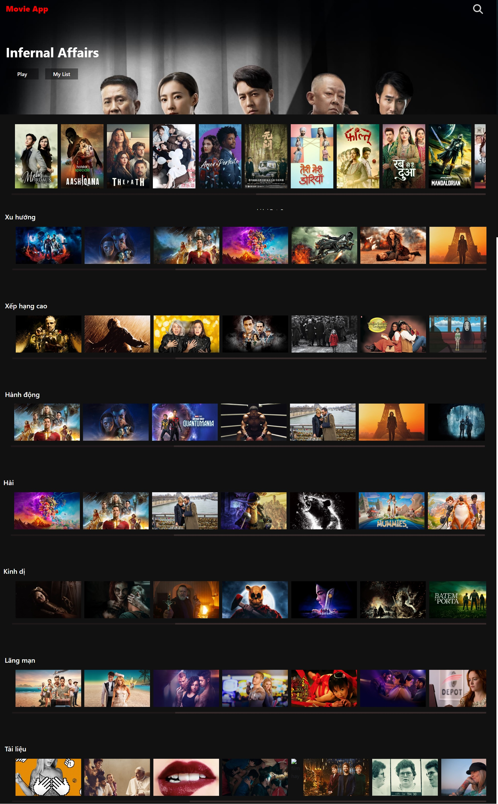
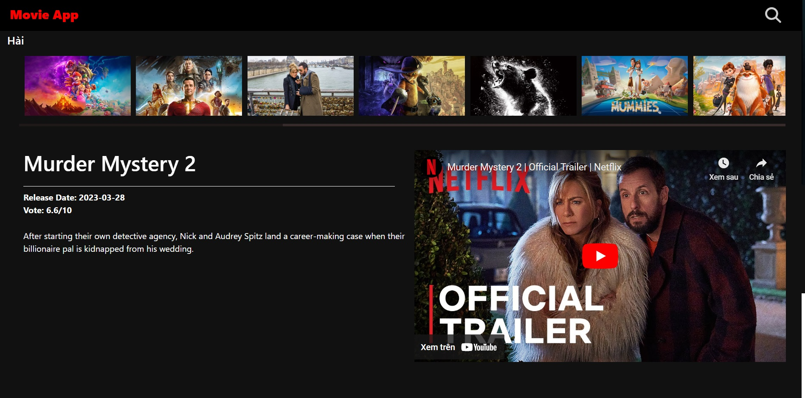
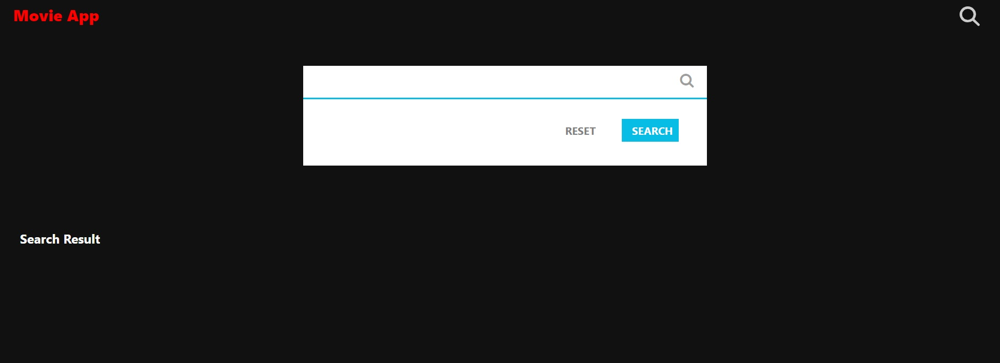
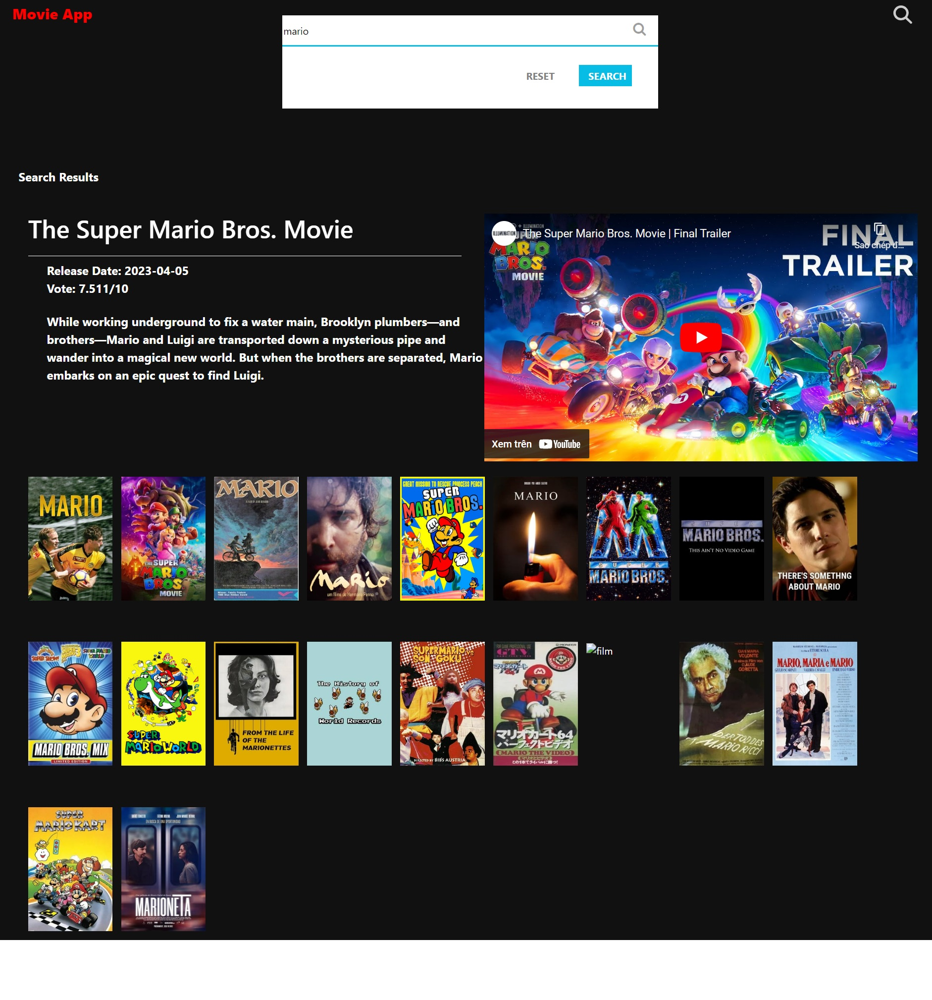

# MOVIE INTRODUCED WEBSITE
## The completion time
 20/09/2022 - 06/10/2022
## Link demo
[View demo](https://movie-introduced-website.vercel.app/)

## Overview
This project helps viewers to know about newly released movies by watching trailers directly on the website and through movie information. In addition, viewers can also watch movie introductions and vote rate. Furthermore, the website categorizes movies into topics to make it easier for viewers to follow new and popular movies.

## Program Language
HTML, CSS, Javascript, React, React-Router, Bootstrap

## Home Page
 - On the homepage, viewers can see an overview of the list of newly updated movies, categorized by trending, high ratings, action, comedy, horror, romance, and documentary.
 
 
 
 - Besides, you can also view details about the movie information and watch trailers or teasers directly on the website by clicking on that movie.

  

 ## Search Page

- On the Search Page, there is an input box where you can search for a movie by entering keywords and clicking on the search button.

 

- In addition, you can view details of the movie and watch trailers or teasers directly on the search page by clicking on the movie.

 
